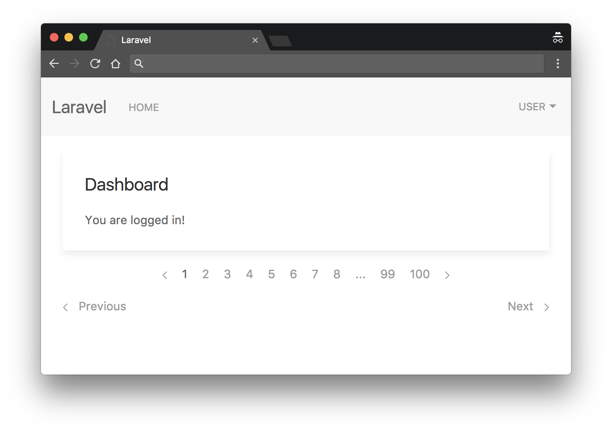

# Laravel UIkit

http://getuikit.com/

後で使うかもしれないのでデフォルトのviewをUIkit使用に書き換えたものを残しておく。



## 環境
- Laravel 5.3
- UIkit 2.26.*

## 使い方
`php artisan make:auth`で作られたviewファイルを入れ替え。好きなように書き換える。

### package.json
uikitとfont-awesome追加。jqueryも必要。
```json
{
  "private": true,
  "scripts": {
    "prod": "gulp --production",
    "dev": "gulp watch",
    "ide-helper:meta": "php artisan ide-helper:meta",
    "ide-helper:generate": "php artisan ide-helper:generate",
    "ide-helper:models": "php artisan ide-helper:models -N"
  },
  "devDependencies": {
    "font-awesome": "^4.6.3",
    "gulp": "^3.9.1",
    "jquery": "^3.1.0",
    "laravel-elixir": "^6.0.0-10",
    "laravel-elixir-webpack-official": "^1.0.2",
    "uikit": "^2.26.4"
  }
}
```

### gulpfile.js
テーマを変えるなら使用するcssを変える。
```javascript
var elixir = require('laravel-elixir');

/*
 |--------------------------------------------------------------------------
 | Elixir Asset Management
 |--------------------------------------------------------------------------
 |
 | Elixir provides a clean, fluent API for defining some basic Gulp tasks
 | for your Laravel application. By default, we are compiling the Sass
 | file for our application, as well as publishing vendor resources.
 |
 */

// uikit themes
// var uikit = 'uikit.min.css';
// var uikit = 'uikit.almost-flat.min.css';
var uikit = 'uikit.gradient.min.css';

elixir(function (mix) {
  mix.sass('app.scss')
    .webpack('app.js')
    .copy('node_modules/uikit/dist/css/' + uikit, 'public/css/uikit.min.css')
    .copy('node_modules/uikit/dist/js/uikit.min.js', 'public/js/')
    .copy('node_modules/jquery/dist/jquery.min.js', 'public/js/')
    .copy('node_modules/font-awesome/fonts/', 'public/fonts')
    .version([
      'css/app.css',
      'js/app.js'
    ]);
});
```

### resources/assets/sass/app.scss
追加のcomponentを使うならapp.scssでimport。
```sass
@import "node_modules/uikit/dist/scss/uikit-mixins";
@import "node_modules/uikit/dist/scss/components/form-advanced";
```

### Pagination
```
php artisan vendor:publish --tag=laravel-pagination
```

で作られた`resources/views/vendor/pagination/default.blade.php`に`uikit.blade.php`の中身をコピペ。

これが使えるのはLaravel 5.3以降。
